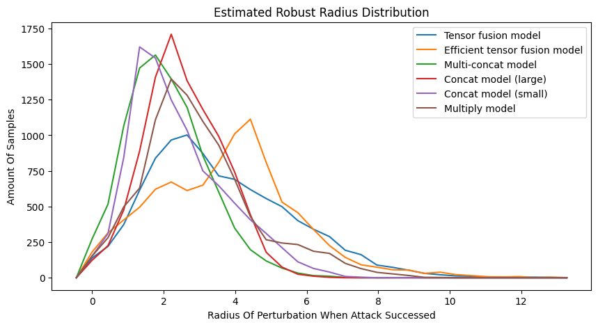

# Robustness Evaluation of Tensor Fusion Networks

> Course project of ECE 273 - Tensor Computation in UCSB

Evaluated the robustness of tensor fusion networks by launching attacks on the whole test dataset.

The attack is paralleled, multiple attacks are asynchronously launched, so it can run pretty fast.

**Result:**

* The areas under the curves of the efficient tensor fusion model and the tensor fusion model are smaller than the others. This means that the samples that can be attacked in these two models are fewer. Thus they are more robust.